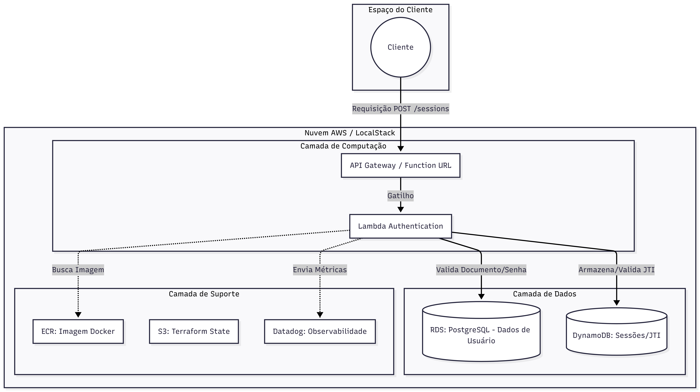

# Tech Challenge: Autenticação de Usuário

Lambda serverless responsável pela autenticação de usuários do sistema. Recebe credenciais (documento + senha), valida contra o banco PostgreSQL do serviço **administrative-api** e gerencia sessões (access token + refresh token) no DynamoDB.

## Tecnologias

- **Linguagem**: Go 1.25
- **Runtime**: AWS Lambda (`provided.al2023`) via imagem Docker
- **Banco de dados**: PostgreSQL (do serviço administrative-api) + DynamoDB (sessões)
- **Infra**: Terraform, Amazon ECR, Amazon RDS, Amazon DynamoDB
- **Ambiente local**: LocalStack, AWS SAM CLI, Docker
- **CI/CD**: GitHub Actions (build → push ECR → Terraform apply)
- **Monitoramento**: Datadog (Lambda Extension)

## Endpoints

| Método | Rota | Descrição |
|--------|------|-----------|
| `POST` | `/sessions` | Login — recebe `document` e `password`, retorna tokens |
| `POST` | `/sessions/refresh` | Refresh — recebe `refresh_token`, retorna novos tokens |
| `DELETE` | `/sessions/logout` | Logout — recebe `Authorization: Bearer <token>` |

## Pré-requisitos

- **Go** 1.25+
- **Docker** e **Docker Compose**
- **AWS SAM CLI** (`sam`)
- **LocalStack** com `LOCALSTACK_AUTH_TOKEN` válido (requer API key)
- Serviço **administrative-api** rodando via Docker Compose (fornece o PostgreSQL e a rede `administrative-api`)

## Execução Local

### 1. Configurar variáveis de ambiente

Copie o arquivo de exemplo e preencha os valores:

```bash
cp .env.example .env
```

As principais variáveis são:

| Variável | Descrição |
|----------|-----------|
| `LOCALSTACK_AUTH_TOKEN` | Token de autenticação do LocalStack |
| `JWT_SECRET` | Segredo para assinatura de access tokens |
| `JWT_REFRESH_SECRET` | Segredo para assinatura de refresh tokens |
| `DB_HOST` | Host do PostgreSQL (ex: `db` na rede Docker) |
| `DB_USER` / `DB_PASSWORD` / `DB_NAME` / `DB_PORT` | Credenciais do banco |
| `DYNAMODB_TABLE_NAME` | Nome da tabela de sessões (padrão: `user-auth-tokens`) |

### 2. Subir dependências

Certifique-se de que o serviço **administrative-api** está rodando (ele cria a rede Docker `administrative-api` e o banco PostgreSQL):

```bash
# No repositório administrative-api
docker compose up -d
```

### 3. Subir infraestrutura local (LocalStack)

Inicia o LocalStack, provisiona IAM role + tabela DynamoDB + API Gateway e faz deploy da Lambda:

```bash
make local
```

### 4. Iniciar SAM local

Builda o binário com SAM e sobe um servidor HTTP local na porta `8081`:

```bash
make sam
```

Os endpoints ficam disponíveis em `http://localhost:8081/sessions`.

### 5. Testar

Requisição via API Gateway (LocalStack):

```bash
make curl
```

Ou invocação direta da Lambda:

```bash
make invoke
```

Para credenciais diferentes:

```bash
make curl DOCUMENT=11122233344 PASSWORD=Admin123!
```

## Comandos disponíveis

Execute `make help` para a lista completa. Os principais:

| Comando | Descrição |
|---------|-----------|
| `make local` | Sobe LocalStack + provisiona infra + deploy da Lambda |
| `make sam` | Builda e inicia SAM local (porta 8081) |
| `make deploy` | Build, zip e deploy no LocalStack |
| `make redeploy` | Atualiza apenas o código (mais rápido) |
| `make seed` | Insere usuários de teste no PostgreSQL |
| `make curl` | POST /sessions via API Gateway |
| `make invoke` | Invocação direta da Lambda |
| `make sessions` | Lista sessões no DynamoDB |
| `make sessions-flush` | Remove todas as sessões |
| `make test` | Executa testes |
| `make clean` | Remove artefatos de build |

## Deploy (AWS)

O deploy real é feito via **GitHub Actions** (push na `main`):

1. Build da imagem Docker e push para o Amazon ECR
2. Terraform apply — provisiona Lambda, DynamoDB, e demais recursos

Para deploy manual:

```bash
cd terraform
terraform init \
  -backend-config="bucket=SEU_BUCKET" \
  -backend-config="region=us-east-1"

terraform apply
```

## Arquitetura


